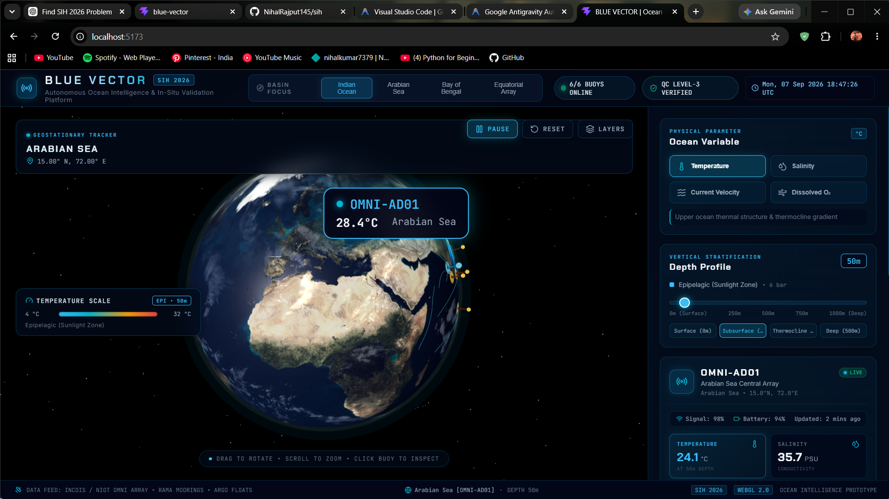

# 🌊 BLUE VECTOR — Ocean Intelligence & In-Situ Observation Platform

[](https://www.sih.gov.in/)
[](https://react.dev/)
[](https://threejs.org/)
[](https://r3f.docs.pmnd.rs/)
[](https://vitejs.dev/)
[](LICENSE)

> **BLUE VECTOR** is an interactive 3D ocean intelligence platform designed for the **Smart India Hackathon (SIH 2026)**. It provides real-time visualization of oceanographic data, in-situ moored buoy telemetry (NIOT/INCOIS OMNI & RAMA arrays), autonomous Argo profiling floats, and numerical hydrodynamic model validation (ROMS / HYCOM) across the Indian Ocean basin.

<p align="center">
  
</p>

---

## 🌟 Key Features

### 1. 🌍 Photorealistic 3D Earth Globe (Continents, Oceans & Relief)
- **High-Resolution 2K Day Texture (`earth_atmos_2048.jpg`)**: Replaces plain monochrome water spheres with realistic continents, shorelines, topography, and ocean bathymetry.
- **Surface Bump & Normal Relief (`earth_normal_2048.jpg`)**: 3D elevation detailing for continental shelves and mountain ridges.
- **Ocean Specular Mask (`earth_specular_2048.jpg`)**: Realistic water glint and sunlight reflection where oceans reflect dynamic directional lighting while continents remain matte.
- **Dynamic Cloud Layer (`earth_clouds_1024.png`)**: Parallax-rotating cloud sphere rendered above the surface.
- **Dual-Atmosphere Ionospheric Halo**: Glowing atmospheric rim and Fresnel back-side lighting in vivid cyan/azure.

### 2. 📍 In-Situ Oceanographic Telemetry Array
- Realistic 3D buoy beacons mapped with millimeter precision onto spherical coordinates ($lat, lon \rightarrow x, y, z$).
- Real-time animated radar sonar rings pulsing on the sea surface.
- Interactive 3D HUD tags anchored above each buoy indicating station code, basin, and active physical measurement.
- Real-world station network:
  - **`OMNI-AD01`** — Arabian Sea Central Array (Deep Basin Mooring)
  - **`RAMA-BO02`** — Equatorial Monsoon Buoy (RAMA Array / Southern Indian Ocean)
  - **`INCOIS-BD08`** — Head Bay of Bengal Observatory (Riverine Runoff Zone)
  - **`ARGO-EQ04`** — Equatorial Jet Profiler (Autonomous Argo Float)
  - **`MET-LAK05`** — Lakshadweep Basin Buoy (NIOT Coastal/Met-Ocean)
  - **`ANDAMAN-S06`** — Andaman Sea Deep Station (Internal Wave Zone)

### 3. 🌊 Indian Ocean Geostrophic Circulation Vectors
- Dynamic 3D streamlines tracing real-world Indian Ocean current systems:
  - **Somali Current Jet** (Western Boundary Current)
  - **Southwest Monsoon Current**
  - **East India Coastal Current (EICC)**
  - **West India Coastal Current (WICC)**
  - **South Equatorial Current**
  - **Bay of Bengal Cyclonic Gyre**

### 4. 🎚️ Vertical Stratification & Physical Depth Profiler
- Continuous depth slider ranging from **0m (Surface)** to **1000m+ (Bathypelagic Abyss)** with quick depth presets:
  - `Surface (0m)`
  - `Subsurface (50m)`
  - `Thermocline (150m)`
  - `Deep (500m)`
- Physical equations for ocean vertical profiles:
  - **Thermocline Exponential Decay**: Thermal stratification dropping from surface warm layer (~29°C) to cold deep water (~3.8°C).
  - **Halocline Profile**: Near-surface salinity variability (Bay of Bengal freshwater dilution vs. Arabian Sea high evaporation) equilibrating at depth.
  - **Geostrophic Velocity Attenuation**: Upper surface wind-driven currents tapering into deep circulation.
  - **Oxygen Minimum Zone (OMZ)**: Simulates the characteristic Northern Indian Ocean intermediate-depth oxygen depletion layer (200m–700m).
  - **Hydrostatic Pressure**: Continuous bar/atmosphere calculation with depth.

### 5. ⚖️ Numerical Model vs. In-Situ Validation Engine
- Real-time comparison between numerical forecast models (**INCOIS ROMS / HYCOM**) and in-situ buoy sensor observations.
- Computes **Divergence Delta ($\Delta$)**, sensor bias percentage, and correlation confidence score.
- Dynamic divergence meter alert flag (Green = Validated $\le 0.8$, Amber = Divergence Detected $> 0.8$).
- INCOIS Level-3 Realtime Quality Control (QC) status tags.

### 6. 🎛️ Mission Control HUD & Fleet Management
- **Basin Quick Switcher**: Jump instantly between *Arabian Sea*, *Bay of Bengal*, *Equatorial Array*, and *Full Indian Ocean*.
- **Globe Controls**: Auto-rotation toggle (Play/Pause), camera reset, and layer overlays toggle (Clouds, Atmosphere, Current Vectors).
- **Fleet Switcher**: Sidebar directory displaying all stations, connection health, signal %, battery levels, and live readings.
- **Telemetry Clock**: Monospace live UTC time ticker.

---

## 🛠️ Technology Stack

| Layer | Technologies |
|---|---|
| **Core Framework** | React 19, JavaScript (ES6+ Modules) |
| **3D Rendering & WebGL** | Three.js (r185), React Three Fiber (R3F v9), React Three Drei (v10) |
| **Build & Tooling** | Vite 8, ESLint 10, Rolldown / Oxc bundler |
| **Icons & Aesthetics** | Lucide React, Glassmorphism, CSS Custom Properties |
| **Typography** | Chakra Petch (Display), Inter (UI), JetBrains Mono (Telemetry) |

---

## 🚀 Getting Started

### Prerequisites
- [Node.js](https://nodejs.org/) (version 18.0 or higher recommended)
- `npm` or `yarn` or `pnpm`

### Installation

1. **Clone the repository:**
   ```bash
   git clone https://github.com/NihalRajput145/sih.git
   cd sih/blue-vector
   ```

2. **Install dependencies:**
   ```bash
   npm install
   ```

3. **Start the local development server:**
   ```bash
   npm run dev
   ```
   Open your browser at `http://localhost:5173`.

4. **Build for production:**
   ```bash
   npm run build
   ```

5. **Preview production build:**
   ```bash
   npm run preview
   ```

---

## 📂 Project Architecture

```
blue-vector/
├── img.png                   # Platform interface preview
├── public/
│   ├── favicon.svg
│   ├── icons.svg
│   └── textures/
│       ├── earth_atmos_2048.jpg      # 2K photorealistic Earth day texture (continents & oceans)
│       ├── earth_normal_2048.jpg     # Surface normal bump relief map
│       ├── earth_specular_2048.jpg   # Ocean water specular reflectance map
│       └── earth_clouds_1024.png     # Atmospheric cloud layer
├── src/
│   ├── components/
│   │   ├── EarthGlobe.jsx            # 3D textured Earth, clouds, atmosphere, buoys, current paths
│   │   ├── Header.jsx                # Mission branding, basin selector, UTC clock, system status
│   │   ├── ControlPanel.jsx          # Ocean variable picker, depth profiler, validation engine
│   │   ├── GlobeHUD.jsx              # Floating 3D HUD controls, layer toggles, legend scale
│   │   └── Footer.jsx                # Telemetry attribution, coordinates, WebGL metadata
│   ├── data/
│   │   └── stations.js               # Indian Ocean buoys, physics formulas & variable configs
│   ├── App.jsx                       # Main application shell and 3D Canvas
│   ├── App.css                       # Mission control styles, glassmorphism, responsive grid
│   ├── index.css                     # Dark viewport reset & custom scrollbars
│   └── main.jsx                      # React entrypoint
├── package.json
├── vite.config.js
└── README.md
```

---

## 🔬 Scientific Data & Methodology

The parameters and coordinates within Blue Vector are modeled after operational oceanographic monitoring networks in the Indian Ocean:

1. **INCOIS (Indian National Centre for Ocean Information Services)**:
   - Moored Buoy Network (OMNI) in the Arabian Sea & Bay of Bengal.
   - Coastal and deep-sea ocean state forecasting (ROMS model).
2. **NIOT (National Institute of Ocean Technology)**:
   - Moored data buoy development and marine sensor payloads.
3. **RAMA (Research Moored Array for African-Asian-Australian Monsoon Analysis and Prediction)**:
   - Tropical Indian Ocean climate and monsoon interaction buoys.
4. **International Argo Program**:
   - Upper ocean autonomous profiling floats (temperature, salinity, pressure profiles to 2000m).

---

## 🔮 Future Roadmap (SIH 2026 Scope)

- [ ] **Live API Integration**: Streaming feeds from INCOIS Web Services & Copernicus Marine Service (CMEMS).
- [ ] **Cyclone Trajectory Layer**: Real-time IMD / JTWC tropical cyclone track and intensity overlay.
- [ ] **AI-Powered Drift Forecasting**: Neural network prediction of oil spill drift and marine debris transport.
- [ ] **Bathymetric Depth Cross-Sections**: 2D slice visualizer for internal waves and oxygen minimum zones.

---

## 📜 License

This project is licensed under the **MIT License** — see the [LICENSE](LICENSE) file for details.

*Developed for Smart India Hackathon (SIH 2026) — Ocean Intelligence Prototype.*
